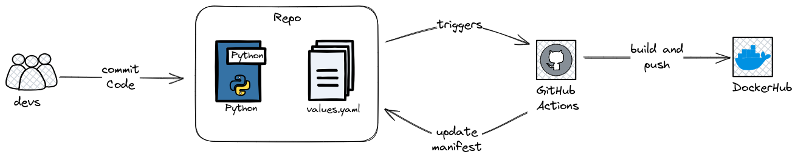

# CI/CD Workflow for Backend

Este repositorio presenta un flujo de trabajo CI/CD para construir, empaquetar y desplegar una aplicación backend utilizando GitHub Actions.

## Flujo de trabajo GitHub Actions

### Construcción y Despliegue de Docker

Este flujo de trabajo realiza la construcción de la imagen Docker, la sube a Docker Hub y actualiza el values de Helm con la nueva etiqueta para desplegar en Kubernetes.

#### Detalles

- **Construcción y Despliegue:**
  - La construcción de la imagen Docker se realiza en el paso `build-and-push`.
  - La imagen se etiqueta con el formato `${{ env.IMAGE_NAME }}:${{ env.TAG_IMAGE }}`.
  - La imagen se sube a Docker Hub.
  - El paso `update` actualiza el values de Helm con la nueva etiqueta.

#### Variables de Entorno

- `DOCKERHUB_USERNAME`: Nombre de usuario de Docker Hub.
- `DOCKERHUB_PASSWORD`: Contraseña de Docker Hub.
- `GIT_SSH_PRIV_KEY`: Clave privada SSH para acceder al repositorio Git.
- `GIT_USER_NAME`: Nombre de usuario Git.
- `GIT_USER_EMAIL`: Correo electrónico asociado al usuario Git.
- `K8S_REPO`: URL del repositorio Kubernetes.

#### Detalles

- **Actualización del values de Helm**
  - Se clona el repositorio.
  - Se actualiza el archivo `values.yaml` con la nueva etiqueta de imagen.
  - Se realiza un commit y un push al repositorio de Kubernetes.
  - El flujo puede ser completado con la implementacion de herramientas Gitops como ArgoCD para detectar los cambios y aplicarlos automaticamente en el cluster de K8S

